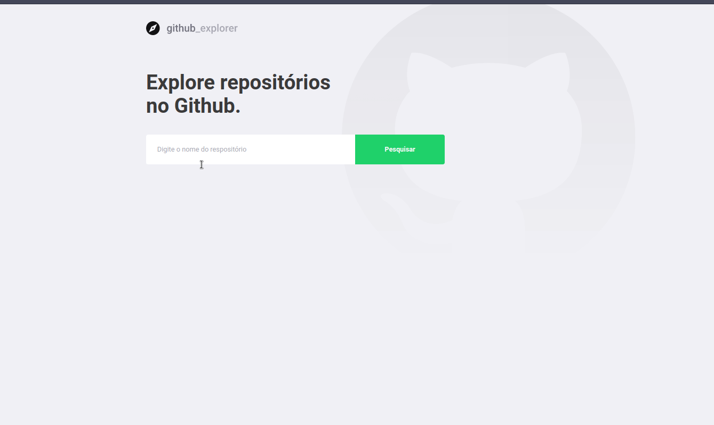

#  :octocat: Github Explorer

## :rocket: :rocket: Projeto realizado no Bootcamp

# Tecnologias

TypeScript ReactJS NodeJS :purple_heart: :purple_heart: :purple_heart:



## ✋🏻 Pré-requisitos

- [Node.js](https://nodejs.org/en/)
- [Yarn](https://yarnpkg.com/pt-BR/docs/install)

## 🔥 Development setup

```sh
npm install or yarn
npm start or yarn start
```
## 👨🏼‍💻 Produzido por:

- [Caique Queiroz](https://github.com/clqueiroz)
